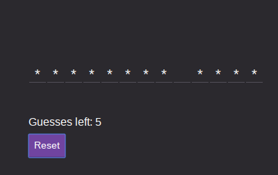
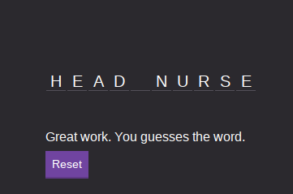

# hangman
Simple hangman game.

### Description ####
A hangman game that gives users **5** guess to guess two words.  New games are automatically generated using a custom  
external API.

### How to Play ####
The game starts with two words with the letters initially hidden. Correct guesses reveal the letters. 

The game ends 
when the user runs out of guess or correctly guess the two words.

####Reset: ####
Press **reset** to start a new game

#### Installation ####
1. Clone in the repo or download and unzip the folder.
2. From the commandline run **npm install** to install the required packages.
3. **npm run dev-server** starts the game on the localhost.
4. **ENJOY!**

#### Author ####
**Built by:**
Nathan Malone

##### Usage ####
This repo can be shared a/o modified by other users. It should **not** be used  commercially.

